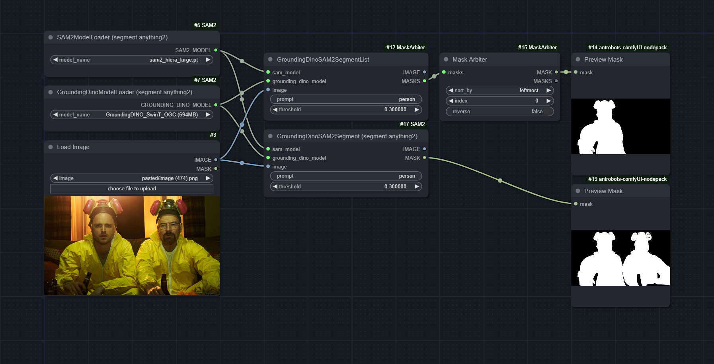

# ComfyUI-MaskArbiter

A node for [ComfyUI](https://github.com/comfyanonymous/ComfyUI) that takes a list of `masks` and returns a single `mask` based on your criteria.

For example, it can be used to mask the leftmost subject in an image containing more than one subject of the same class. The workflow below demonstrates the difference between Mask Arbiter (top) and traditional Grounding DINO masking (bottom.)

### Installation

Simply drag the image above into ComfyUI and use [ComfyUI Manager » Install Missing Custom Nodes](https://github.com/ltdrdata/ComfyUI-Manager).

> [!NOTE]
> ComfyUI-MaskArbiter is packaged with a modified version of the GroundingDinoSAM2Segment node from [ComfyUI-SAM2](https://github.com/neverbiasu/ComfyUI-SAM2). This version of the node outputs a list of masks that you can feed into Mask Arbiter. It is called **"GroundingDinoSAM2SegmentList."**

---

### Inputs

- `masks`: A list of masks to process with Mask Arbiter, such as the outputs of Segment Anything.
- `sort_by`: The method of sorting your `masks`. Possible options include `leftmost` (sort left to right), `topmost` (sort top to bottom), `innermost` (prioritize closest to center of your image), `largest` (sort by pixel area occupied), `initial` (do not sort), `random` (sort randomly), and `merged` (combine all masks and merge into one.)
- `reverse`: Reverses the mask list order after sorting. For example, if you sort by `leftmost` and enable `reverse`, you'll get the rightmost subject.
- `index`: The individual mask to return after sorting, zero-indexed.

### Outputs

- `MASK`: A mask of the selected `index` after sorting.
- `MASKS`: The entire mask list after sorting.

---

This script was adapted from the `[txt2mask]` shortcode of [Unprompted](https://github.com/ThereforeGames/unprompted), my Automatic1111 extension.