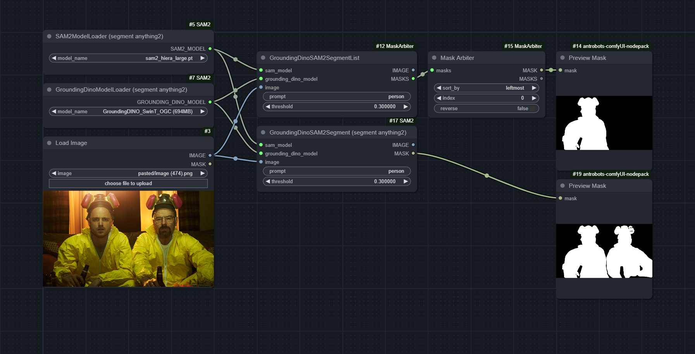

# ComfyUI Mask Arbiter

Mask Arbiter sorts, merges, and selects masks while preserving their original resolution.

## Inputs

- `sort_by`: Keep the initial order, randomize it, merge all masks, or order masks by position or area.
- `index`: Select an item from the resulting order. Values past the end select the last mask.
- `resolution`: Maximum evaluation width or height used to accelerate sorting. Use `0` for full resolution. This does not resize outputs.
- `average`: Use mask centroids for positional sorting instead of the nearest relevant edge or pixel.
- `reverse`: Reverse the completed order before selecting `index`.
- `masks` / `mask`: Connect either input. The standard `mask` input takes precedence when both are connected.

## Outputs

- `selected_mask`: The mask selected by `index`, returned as a standard ComfyUI mask batch.
- `ordered_masks`: All masks in their resulting order. `merged` produces a one-item list.

> [!NOTE]
> ComfyUI-MaskArbiter is packaged with a modified version of the GroundingDinoSAM2Segment node from [ComfyUI-SAM2](https://github.com/neverbiasu/ComfyUI-SAM2). Look for **"GroundingDinoSAM2SegmentList."** This version of the node outputs a list of masks that you can feed into Mask Arbiter. It also enables support for SAM 2.1 models.  **You do not need this if you are using SAM 3 instead.**

An empty tensor batch such as `[0, H, W]` returns a black `[1, H, W]` selected mask and preserves the empty batch on `ordered_masks`.

## Additional node

`GroundingDinoSAM2SegmentList` runs GroundingDINO detection followed by SAM2 segmentation and returns detected image/mask items.

---

### Inputs

- `mask` OR `masks`: A list of masks to process with Mask Arbiter, such as the outputs of Segment Anything. Supports either datatype for compatibility with different masking nodes.
- `sort_by`: The method of sorting your `masks`. Possible options include `leftmost` (sort left to right), `topmost` (sort top to bottom), `innermost` (prioritize closest to center of your image), `largest` (sort by pixel area occupied), `initial` (do not sort), `random` (sort randomly), and `merged` (combine all masks and merge into one.)
- `reverse`: Reverses the mask list order after sorting. For example, if you sort by `leftmost` and enable `reverse`, you'll get the rightmost subject.
- `index`: The individual mask to return after sorting, zero-indexed.

### Outputs

- `MASK`: A mask of the selected `index` after sorting.
- `MASKS`: The entire mask list after sorting.

---

This script was adapted from the `[txt2mask]` shortcode of [Unprompted](https://github.com/ThereforeGames/unprompted), my Automatic1111 extension.
